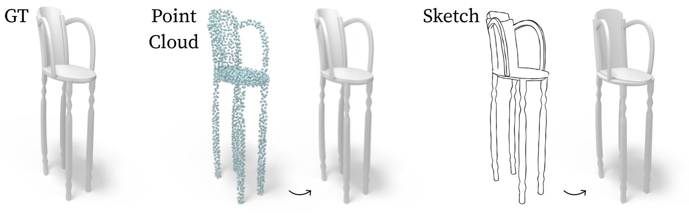
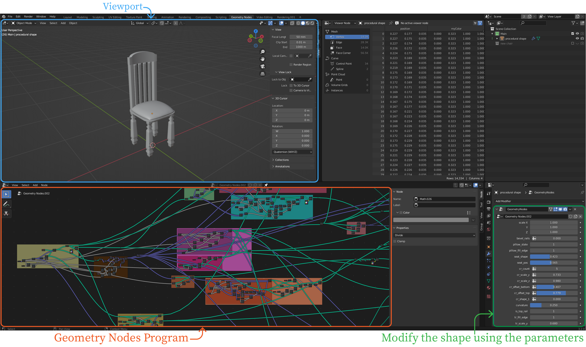

# GeoCode: Interpretable Shape Programs [[Project Page](https://threedle.github.io/GeoCode/)]
[](https://arxiv.org/abs/2212.11715)

*[Ofek Pearl](https://github.com/ofekp), [Itai Lang](https://scholar.google.com/citations?user=q0bBhtsAAAAJ), [Yuhua Hu](https://yuhuahu310.github.io/), [Raymond A. Yeh](https://raymond-yeh.com/), [Rana Hanocka](https://people.cs.uchicago.edu/~ranahanocka/)*


> We present GeoCode, a technique for 3D shape synthesis using an intuitively editable parameter space. We build a novel program that enforces a complex set of rules and enables users to perform intuitive and controlled high-level edits that procedurally propagate at a low level to the entire shape. Our program produces high-quality mesh outputs by construction. We use a neural network to map a given point cloud or sketch to our interpretable parameter space. Once produced by our procedural program, shapes can be easily modified. Empirically, we show that GeoCode can infer and recover 3D shapes more accurately compared to existing techniques and we demonstrate its ability to perform controlled local and global shape manipulations.

<p align="center">


</p>
<p align="center">
A demo video of our program is available on our <a href="https://threedle.github.io/GeoCode/">project page</a>.
</p>


## Requirements
- Python 3.8
- CUDA 11.8
- GPU, minimum 8 GB ram
- During training, a machine with 5 CPUs is recommended 
- During _visualization_ and _sketch generation_, we recommend a setup with multiple GPU nodes, refer to the additional information to run in parallel on all available nodes
- During test-set evaluation, generation of raw shapes for a new dataset, and during _stability metric_ evaluation, a single node with 20 CPUs is recommended

## Running the test-set evaluation using our dataset and saved checkpoint

<p align="center">

</p>

### Installation

Clone and create the Conda environment
```bash
git clone https://github.com/threedle/GeoCode.git
cd GeoCode
conda env create -f environment.yml
conda activate geocode
python setup.py install

# Install Blender 3.2 under `~/Blender`
./scripts/install_blender3.2.sh

# Download the dataset (`~/datasets`), checkpoint (`~/models`) and blend file (`~/blends`) of the `chair` domain
python scripts/download_ds.py --domain chair --datasets-dir ~/datasets --models-dir ~/models --blends-dir ~/blends
```

`vase` and `table` domains are also available

### Run the test for the chair domain (1 GPU and 20 CPUs setup is recommended)

Run the test for the `chair` domain using the downloaded checkpoint, make sure the directories match the directories that were used in the `download_ds.py` step
```bash
cd GeoCode
conda activate geocode
python geocode/geocode.py test --blender-exe ~/Blender/blender-3.2.0-linux-x64/blender --blend-file ~/blends/procedural_chair.blend --models-dir ~/models --dataset-dir ~/datasets/ChairDataset --input-type pc sketch --phase test --exp-name exp_geocode_chair
```

This will generate the results in the following directory structure, in 
```
<datasets-dir>
│
└───ChairDataset
    │
    └───test
        │
        └───results_exp_geocode_chair
            │
            └───barplot                    <-- model accuracy graph
            └───obj_gt                     <-- 3D objects of the ground truth samples
            └───obj_predictions_pc         <-- 3D objects predicted from point cloud input
            └───obj_predictions_sketch     <-- 3D objects predicted from sketch input
            └───yml_gt                     <-- labels of the ground truth objects
            └───yml_predictions_pc         <-- labels of the objects predicted from point cloud input
            └───yml_predictions_sketch     <-- labels of the objects predicted from sketch input
```

We also provide a way to automatically render the resulting 3D objects. Please note that this step is GPU intensive due to rendering, the use of multiple nodes with GPU is recommended. Please see the additional information for running this in parallel.

```bash
cd GeoCode
conda activate geocode
~/Blender/blender-3.2.0-linux-x64/blender ~/blends/procedural_chair.blend -b --python visualize_results/visualize.py -- --dataset-dir ~/datasets --dataset-name ChairDataset --phase test --exp-name exp_geocode_chair
```

this will generate the following additional directories under `results_exp_geocode_chair`:
```
            ⋮
            └───render_gt                  <-- renders of the ground truth objects
            └───render_predictions_pc      <-- renders of the objects predicted from point cloud input
            └───render_predictions_sketch  <-- renders of the objects predicted from sketch input
```

## Run training on our dataset (1 GPU and 5 CPUs setup is recommended)

Training from a checkpoint or new training is done similarly, and only depends on the existence of a `latest.ckpt` checkpoint file in the experiment directory (under `~/models` in this example).
Please note that training using our checkpoints will show a starting epoch of 0.

```bash
cd GeoCode
conda activate geocode
python geocode/geocode.py train --models-dir ~/models --dataset-dir ~/datasets/ChairDataset --nepoch=600 --batch_size=33 --input-type pc sketch --exp-name exp_geocode_chair
```

## Inspecting the blend files

Open one of the Blend files using Blender 3.2.

To modify the shape using the parameters and to inspect the Geometry Nodes Program click the "Geometry Node" workspace at the top of the window


Then you will see the following screen




# Additional Information

## Logging

For logging during training, we encourage the use of [neptune.ai](https://neptune.ai/).
First open an account and create a project, create the file `GeoCode/config/neptune_config.yml` with the following content:

```
neptune:
  api_token: "<TOKEN>"
  project: "<POJECT_PATH>"
```
## Downloading the datasets, blend files, and checkpoint files
When downloading one or more domain using:
```bash
python scripts/download_ds.py --domain chair --datasets-dir ~/datasets --models-dir ~/models --blends-dir ~/blends
python scripts/download_ds.py --domain vase --datasets-dir ~/datasets --models-dir ~/models --blends-dir ~/blends
python scripts/download_ds.py --domain table --datasets-dir ~/datasets --models-dir ~/models --blends-dir ~/blends
```

The resulting directory structure will be (example for the `chair` domain):

```
<datasets-dir>
│
└───ChairDataset
    │
    └───recipe.yml
    │
    └───train
    │   └───obj_gt
    │   └───point_cloud_fps
    │   └───point_cloud_random
    │   └───sketches
    │   └───yml_gt
    │   └───yml_gt_normalized
    │
    └───val
    │   └───obj_gt
    │   └───...
    │
    └───test
        └───obj_gt
        └───...
        
<models-dir>
│
└───exp_geocode_chair
    │
    └───procedural_chair_epoch585_ckpt.zip
    └───procedural_chair_last_ckpt.zip
    └───procedural_chair_epoch585.ckpt
    └───last.ckpt

<blends-dir>
│
└───procedural_chair.blend
```

## Visualize the results using multiple GPU nodes in parallel

When visualizing the results, we render an image for each ground truth and prediction 3D object that were created while running the test-set evaluation. Since this is GPU intensive task, we provide a way to run this in parallel on multiple GPU machines.
To do so, simply add the flags `--parallel 10 --mod $NODE_ID` to the visualization command, for example, for 10 nodes:

```bash
cd GeoCode
conda activate geocode
~/Blender/blender-3.2.0-linux-x64/blender ~/blends/procedural_chair.blend -b --python visualize_results/visualize.py -- --dataset-dir ~/datasets --dataset-name ChairDataset --phase test --exp-name exp_geocode_chair --parallel 10 --mod $NODE_ID
```

where `$NODE_ID` is the node id.

## Creating a new dataset

### Step 1 - define the dataset
You can optionally edit the `dataset_generation` or the `camera_angles` sections in the appropriate `recipe` YAML file. For example, for the chair domain, edit the following recipe file:
`GeoCode/dataset_generator/recipe_files/chair_recipe.yml`. We encourage the user to inspect the relevant Blend file before modifying the recipe file.

### Step 2 - generate the raw objects (20 CPUs with 8GB memory per CPU is recommended)
In this step no GPU and no conda env are required.

For example, generating the val, test, and train datasets for the chair domain, with 3, 3, and 30 shape variation per parameter value, is done using the following commands: 

```bash
cd GeoCode
~/Blender/blender-3.2.0-linux-x64/blender ~/blends/procedural_chair.blend -b --python dataset_generator/dataset_generator.py -- generate-dataset --dataset-dir ~/datasets/MyChairDataset --domain chair --phase val --num-variations 3 --parallel 20
~/Blender/blender-3.2.0-linux-x64/blender ~/blends/procedural_chair.blend -b --python dataset_generator/dataset_generator.py -- generate-dataset --dataset-dir ~/datasets/MyChairDataset --domain chair --phase test --num-variations 3 --parallel 20
~/Blender/blender-3.2.0-linux-x64/blender ~/blends/procedural_chair.blend -b --python dataset_generator/dataset_generator.py -- generate-dataset --dataset-dir ~/datasets/MyChairDataset --domain chair --phase train --num-variations 30 --parallel 20
```

For vase domain
```bash
~/Blender/blender-3.2.0-linux-x64/blender ~/blends/procedural_vase.blend -b --python dataset_generator/dataset_generator.py -- generate-dataset --dataset-dir ~/datasets/MyVaseDataset --domain vase --phase val --num-variations 3 --parallel 20
~/Blender/blender-3.2.0-linux-x64/blender ~/blends/procedural_vase.blend -b --python dataset_generator/dataset_generator.py -- generate-dataset --dataset-dir ~/datasets/MyVaseDataset --domain vase --phase test --num-variations 3 --parallel 20
~/Blender/blender-3.2.0-linux-x64/blender ~/blends/procedural_vase.blend -b --python dataset_generator/dataset_generator.py -- generate-dataset --dataset-dir ~/datasets/MyVaseDataset --domain vase --phase train --num-variations 30 --parallel 20
```

For table dataset
```bash
~/Blender/blender-3.2.0-linux-x64/blender ~/blends/procedural_table.blend -b --python dataset_generator/dataset_generator.py -- generate-dataset --dataset-dir ~/datasets/MyTableDataset --domain table --phase val --num-variations 3 --parallel 20
~/Blender/blender-3.2.0-linux-x64/blender ~/blends/procedural_table.blend -b --python dataset_generator/dataset_generator.py -- generate-dataset --dataset-dir ~/datasets/MyTableDataset --domain table --phase test --num-variations 3 --parallel 20
~/Blender/blender-3.2.0-linux-x64/blender ~/blends/procedural_table.blend -b --python dataset_generator/dataset_generator.py -- generate-dataset --dataset-dir ~/datasets/MyTableDataset --domain table --phase train --num-variations 30 --parallel 20
```

Please note that the shapes generated in this step are already normalized.

### Step 3 - generate the sketches (usage of multiple nodes with GPU is recommended)

This step does not require a conda env but requires GPU(s)

```bash
cd GeoCode
~/Blender/blender-3.2.0-linux-x64/blender ~/blends/procedural_vase.blend -b dataset_generators/sketch_generator.py -- --dataset-dir ~/datasets/MyChairDataset --phases val test train
```

You can also run this in parallel, for example, with 10 processes, by adding the flags `--parallel 10 --mod $NODE_ID`

Once you train on the new dataset, a preprocessing step of the dataset will be performed. The point cloud sampling and normalized label directories and files will be created under the dataset directory. Refer to the `Download the datasets` section at the top of this readme for the directory structure.


## Stability metric (20 CPUs setup is recommended)
To evaluate a tested dataset phase using our _stability metric_ use the following command:

```bash
cd GeoCode/stability_metric
python stability_parallel.py --blender-exe ~/Blender/blender-3.2.0-linux-x64/blender --dir-path ~/datasets/ChairDataset/val/obj_gt
```

## Additional scripts

In our tests we also used [COSEG dataset](http://irc.cs.sdu.edu.cn/~yunhai/public_html/ssl/ssd.htm). A preprocessing step is required when working with external datasets.
- 3D shapes should be in .obj format
- 3D shapes should be normalized before training or testing

we provide a command to download an additional script that allows working with COSEG samples.
Additionally, we provide the code to simplify a dataset (mesh simplification).
Please refer to the README.md file that is downloaded along with the scripts after executing the following command:

```bash
cd GeoCode
scripts/download_ds_processing_scripts.py
```

## Code structure

- `common` - util packages and classes that are shared by multiple other directories
- `config` - contains the neptune.ai configurations file
- `data` - dataset related classes
- `dataset_processing` - scripts that are intended to manipulate existing datasets
- `geocode` - main training and testing code
- `models` - point cloud and sketch encoders and the decoders network
- `scripts` - contains script to set up our datasets and saved checkpoints 
- `stability_metric` - script to evaluate a tested phase using our *stability metric*
- `visualize_results` - script to generate the renders for all ground truth and predicted shapes

# Citation
```
@article{pearl2022geocode,
  title={GeoCode: Interpretable Shape Programs},
  author={Pearl, Ofek and Lang, Itai and Hu, Yuhua and Yeh, Raymond A. and Hanocka, Rana},
  booktitle={arXiv preprint arxiv:2212.11715},
  year={2022}
}
```
